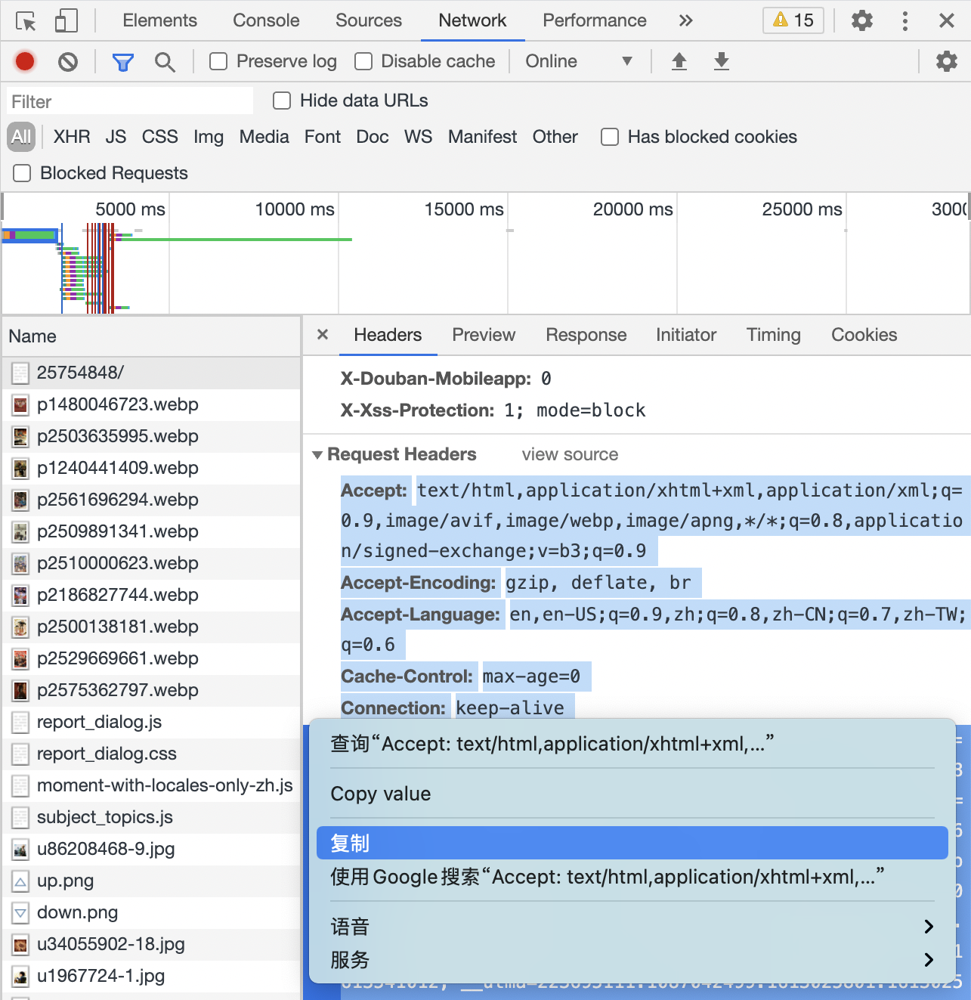

# 豆瓣“想看”片源整理器
我在豆瓣标为“想看”的影片都在哪里能看到？

## 前言

如果你不知怎么地找到了这篇文章，很有可能你是个很重视自己的精神食粮的人，对影视作品的质量有很高的要求。那你也许也认识到，现在国内文化产业方兴未艾，好的内容创造者有时得不到足够的激励，劣币驱逐良币。因此，请务必支持正版，用你的钱为优秀的作品投票。这个工具的作用，是帮助已经是视频网站的付费会员的你，获得更加的观赏体验。如果你是想找盗版片源，你可以离开了。

## 适用场景

这个工具来源自于我的一个观影习惯：我几乎只在买了会员的视频网站看电影、电视剧，但往往同一时间只会是一家视频网站的会员。所以我会在一家视频网站上看完热播和想看的剧后，再切换到下一家视频网站，循环往复。

但这样就有个问题：很难知道这家视频网站上有哪些我想要看的剧。这些视频网站的推荐机制几乎都做得惨不忍睹，它们明明有我想看的剧，但页面上展示的都是些千人一面的无聊信息，根本无从下手。

还好，我在豆瓣上长年累月标记了不少“想看”的影片。而且豆瓣有个功能，会在每个影片的页面上，显示“在哪儿看这部电影（剧集）”。只是，这只适用于根据剧找视频网站，不适合根据视频网站找剧。

所以，我就写了这个小工具，自动把每个剧所在的视频网站整理成如下的表格。这样我就能针对自己在用的视频网站按图索骥了！


## 使用步骤

这个流程还是挺麻烦的，但至少好过手动地一个个查找整理。我已经尽可能地让这个步骤详细，但还是可能因个人电脑环境的不同而会有问题，所以仅推荐有技术背景的朋友使用。如果需要帮助，或者有修改建议，欢迎[提Issue](https://github.com/nblintao/douban-video-detector/issues/new/choose)让我知道。

1. 使用[豆伴](https://blog.doufen.org/posts/tofu-user-guide/)（豆瓣账号备份工具）爬取自己豆瓣账号，导出数据，得到一个文件名类似于“`豆伴(12345678).xlsx`”的文件。

2. 下载[`douban_video_detector.py`](https://github.com/nblintao/douban-video-detector/blob/main/douban_video_detector.py)，放到同个文件夹中。

3. 用文本编辑器打开`douban_video_detector.py`文件，做如下改动：

    1. 用你在第1步中得到的豆伴文件名，替换`orgin_filename` 引号中的样例。
    2. 在浏览器（推荐Chrome）中打开开发者工具，在登录状态下访问一个豆瓣网页（如https://movie.douban.com/subject/25754848/），如下图所示得到“Response Headers”。复制，用它替换`header_str`引号中的样例。

4. 打开命令行，安装python3和需要的包。比如在macOS上，打开“终端”执行：

    ```sh
    xcode-select --install &&
    curl https://bootstrap.pypa.io/get-pip.py -o get-pip.py &&
    python3 get-pip.py --force-reinstall &&
    pip install openpyxl requests bs4
    ```

5. 在命令行中，进入1、2中文件所在的文件夹，执行
    ```sh
    python3 douban_video_detector.py
    ```
6. 等执行完毕，你应该能在文件夹中看到一个类似“`新豆伴(12345678).xlsx`”的文件。打开，切换到“想看”工作表，就能看到你的劳动成果了。


感谢你支持中国的影视产业。欢迎转发给有需要的朋友，欢迎关注我的公众号[青菜年糕汤](https://qcngt.com)！